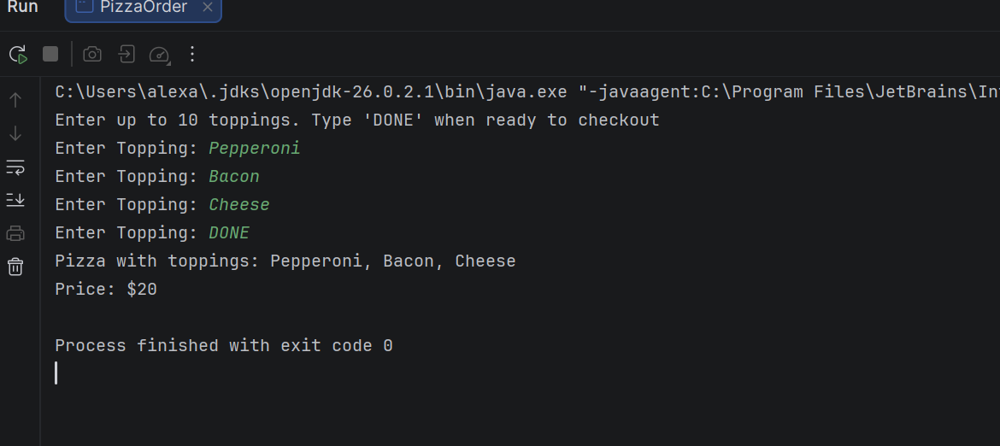
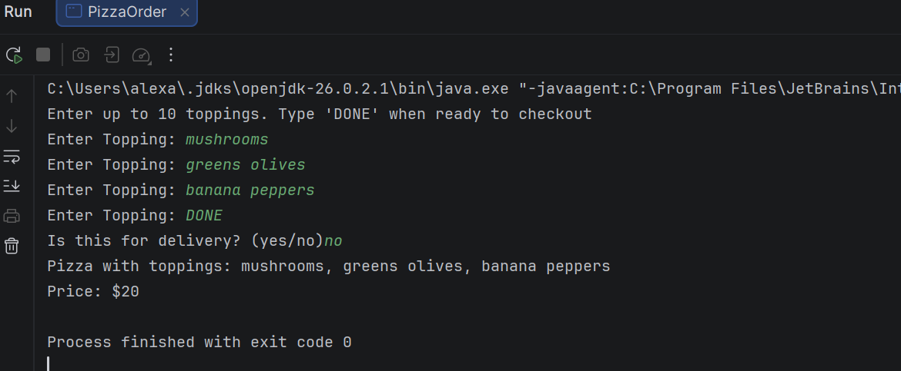
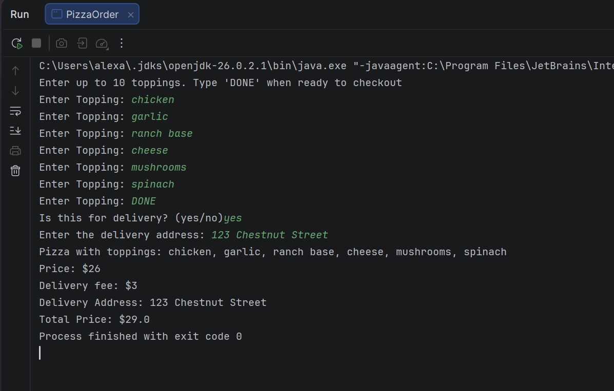
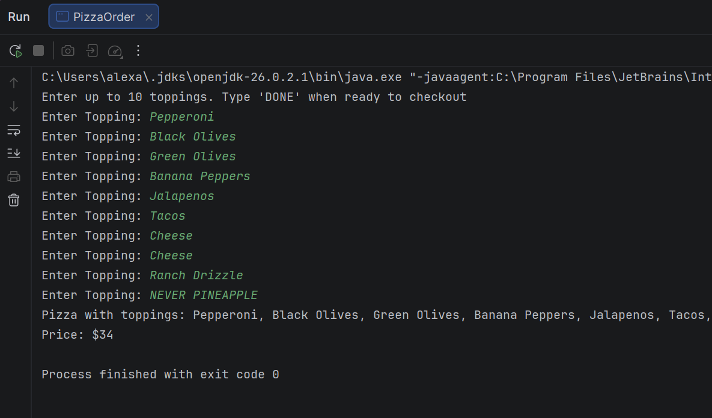

# Pizza Topping Array

## Project Description
Program written for Java Course  program that stores pizza toppings in a String array, calculates the cost of a pizza based on the number of toppings, and creates a delivery pizza subclass that adds a delivery address & delivery fee.

## How to Run
1. Open the project in IntelliJ.
2. Open `src/PizzaOrder.java`.
3. Run `PizzaOrder.java`.
4. Enter toppings (limit 10), then enter DONE when done.
5. Choose whether pizza is for delivery (yes/no). If for delivery, enter address.
6. Pizza and delivery (if applicable) results will be displayed and totaled.

## Screenshots

### Topping and Price Calculation

### Pizza Not for Delivery

### Delivery Pizza

### Maximum Topping Limit Reached

